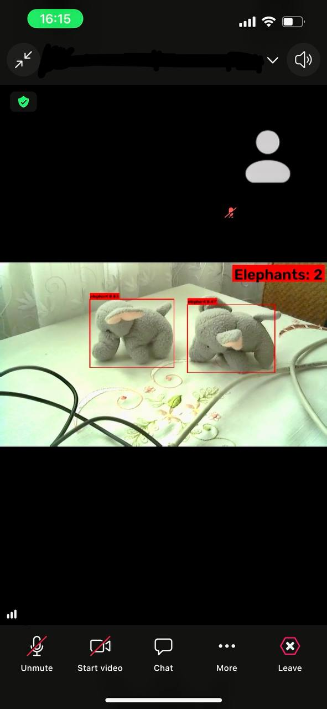

# YOLO Elephant Detection & Virtual Camera Pipeline

This project builds a custom YOLO-based elephant detector from the OpenImages dataset and streams the detections (along with other filter options like grayscale, mirror, and raw) to virtual webcams using **UnityCapture** and **pyvirtualcam**.

Below is an example of the active YOLO virtual camera filter being used as the video input inside a Zoom call to detect and count objects in real-time:



---

## Features

- **Dataset Scraping & Conversion**: Downloads elephant bounding-box data from the OpenImages v7 dataset (via Hugging Face), filters the labels, and sets up a YOLO-compliant dataset structure.
- **YOLO Training**: Streamlined training script for fine-tuning YOLO models (e.g., YOLO11 nano/small) with options customized for modest GPU memory sizes (e.g., 4GB VRAM).
- **Multi-Camera Processing**: Captures a single physical webcam input feed and splits it across four separate virtual camera feeds simultaneously:
  1. **Raw**: Original video stream.
  2. **Grayscale**: Converted to grayscale.
  3. **Mirror**: Horizontally flipped.
  4. **YOLO**: Active real-time elephant detection with custom bounding boxes, confidence scores, and a live object count overlay.

---

## Prerequisites

1. **Python 3.8+**
2. **CUDA-enabled GPU** (highly recommended for training/inference)
3. **UnityCapture Virtual Cameras**:
   - Register the UnityCapture DirectShow filters in Windows so the virtual cameras are recognized by the system (e.g., `Unity Video Capture`, `Unity Video Capture #2`, etc.).
   - Follow the standard registration instructions on the [UnityCapture repository](https://github.com/schellingb/UnityCapture) to register the filter drivers.
   - **Multiple Camera Support**:
     - This setup utilizes changes from [UnityCapture Pull Request #36](https://github.com/schellingb/UnityCapture/pull/36). The `UnityCaptureFilter32.dll` and `UnityCaptureFilter64.dll` binaries have been recompiled to make the separate virtual cameras distinguishable by other applications.
   - **Warning (API Compatibility)**:
     - These virtual cameras are implemented using the **DirectShow API**, not **Media Foundation**. Modern Windows/UWP applications or software that strictly require Media Foundation virtual webcams may not detect them.

---

## Installation

1. Install the required dependencies:
   ```bash
   pip install -r requirements.txt
   ```

2. Make sure you have downloaded or trained a model weights file (`.pt`) and placed it in the appropriate folder (e.g., `runs/detect/runs/elephant/yolo26n/weights/best.pt`).

---

## Project Structure & Usage

### 1. Dataset Collection
Run `create_dataset.py` to stream the dataset, filter for elephants, extract labels to YOLO format, partition it into splits, and generate `data.yaml`:
```bash
python create_dataset.py
```

### 2. Fine-Tuning the Model
Run `train_yolo.py` to train/fine-tune the model:
```bash
python train_yolo.py
```
*Note: This script is configured with `batch=2`, `amp=True`, and `cache=False` to prevent Out-Of-Memory (OOM) errors on GPUs with 4GB VRAM.*

### 3. Local Evaluation & Benchmark
Test model inference on a random image from the training split, measure processing times, and view the annotated result inline:
```bash
jupyter notebook test_yolo.ipynb
```

### 4. Running the Virtual Cameras
Connect a physical camera and feed the streams into your registered UnityCapture devices:
```bash
python multi_virtual_camera.py --camera 0 --width 1280 --height 720 --fps 25
```
This will start 4 output threads matching these DirectShow device names:
- `Unity Video Capture` (Raw)
- `Unity Video Capture #2` (Grayscale)
- `Unity Video Capture #3` (Mirror)
- `Unity Video Capture #4` (YOLO Elephant Detection)

---

## Configuration

You can customize camera assignments, weights path, and confidence thresholds inside `multi_virtual_camera.py` under the `OUTPUTS` mapping:

```python
OUTPUTS = {
    "Unity Video Capture": ("raw", {}),
    "Unity Video Capture #2": ("grayscale", {}),
    "Unity Video Capture #3": ("mirror", {}),
    "Unity Video Capture #4": ("yolo", {
        "weights_path": "runs/detect/runs/elephant/yolo26n/weights/best.pt",
        "conf": 0.4,
        "box_color": (0, 0, 255),
    })
}
```
